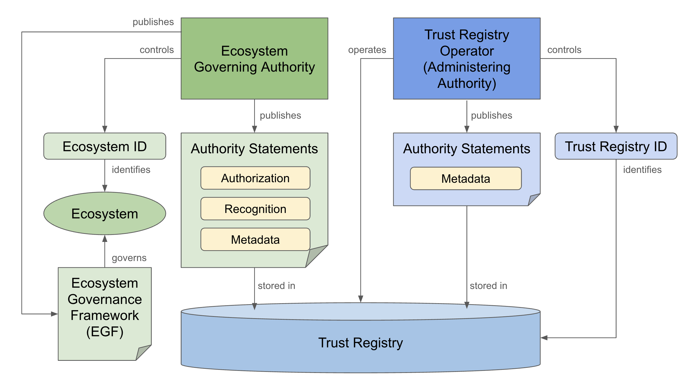

## Conventions and Definitions

### Keywords
The key words "MUST", "MUST NOT", "REQUIRED", "SHALL", "SHALL NOT", "SHOULD", "SHOULD NOT", "RECOMMENDED",  "MAY", and "OPTIONAL" in this document are to be interpreted as described in [IETF RFC 2119](https://datatracker.ietf.org/doc/html/rfc2119).

### Augmented Backus-Naur Form (ABNF)
The syntax definitions in this specifications use Augmented Backus-Naur Form (ABNF) as defined in [IETF RFC 5234](https://datatracker.ietf.org/doc/html/rfc5234).

### Definitions

 [[def:authority statement, authority statements]]
~ An assertion by an authority about another entity. Types of authority statements include authorization, recognition, delegation, and description (metadata).

 [[def:authorization statement, authorization statements]]
~ An authority statement in which an authority grants an authorization to an entity over which it has authority.

 [[def:delegation statement, delegation statements]]
~ An authority statement in which an authority delegates a specific scope of authority to another entity.

 [[def:description statement, description statements]]
~ An authority statement in which an authority asserts metadata describing an entity.

 [[def:digital trust ecosystem, digital trust ecosystems]]
~ A [digital ecosystem](https://glossary.trustoverip.org/#term:digital-ecosystem) in which participants are one or more interoperating [trust communities](https://glossary.trustoverip.org/#term:trust-communities). Governance of various [roles](https://glossary.trustoverip.org/#term:roles) within this ecosystem is typically managed by a [governing body](https://glossary.trustoverip.org/#term:governing-body) using a [governance framework](https://glossary.trustoverip.org/#term:governance-framework). Many digital trust ecosystems maintain one or more [trust registries](https://glossary.trustoverip.org/#term:trust-registries).

 [[def:ecosystem]]
~ See [[ref:digital trust ecosystem]].

 [[def:ecosystem governing authority]]
~ The entity responsible for governance of a [[ref:digital trust ecosystem]] and for publishing its [[ref:authority statements]]. An ecosystem governing authority may take any legal form or may not be a formal legal entity at all.

 [[def:ecosystem ID]]
~ The globally unique identifier of a [[ref:digital trust ecosystem]].

 [[def:ecosystem governance framework, ecosystem governance frameworks]]
~ A [governance framework](https://glossary.trustoverip.org/#term:governance-framework) for a [digital trust ecosystem](https://glossary.trustoverip.org/#term:digital-trust-ecosystem). This may incorporate other types of frameworks such as [credential governance frameworks](https://glossary.trustoverip.org/#term:credential-governance-framework).

 [[def:entity ID]]
~ The unique identifier of an entity within a [[ref:digital trust ecosystem]].

 [[def:inter-ecosystem]]
~ An adjective describing relationships and data exchanges between participants in two or more separate ecosystems operating under separate governance frameworks.

 [[def:intra-ecosystem]]
~ An adjective describing relationships and data exchanges between participants operating within the same ecosystem and the same governance framework.

 [[def:recognition statement, recognition statements]]
~ An authority statement in which one authority recognizes the authority of another authority as a peer. Note that this recognition relationship may be unilateral or bilateral and is non-exclusive.

 [[def:TRQP binding, TRQP bindings]]
~ A technical specification defining how to implement the TRQP Core protocol over a specific transport protocol.

 [[def:TRQP bridge, TRQP bridges]]
~ A system that connects a [[ref:TRQP endpoint]] to a [[ref:system of record]]. The bridge transforms a TRQP query into the query format supported by the system of record and performs the reverse mapping for the response.

 [[def:TRQP Core]]
~ The foundational specification that defines core data models, query vocabulary, and other requirements for the Trust Registry Query Protocol.

 [[def:TRQP consumer]]
~ A network device (client or server) that send TRQP queries to a TRQP endpoint.

 [[def:TRQP endpoint]]
~ The network service endpoint for trust registry that speaks TRQP.

 [[def:trust registry]]
~ A repository that serves as a source for [[ref:authority statements]] or other governed information describing one or more trust communities. A trust registry is typically authorized by an [[ref:ecosystem governance framework]].

 [[def:trust registry operator]]
~ The legal entity responsible for operating a [[ref:trust registry]]. A trust registry may be operated directly by an [ref:ecosystem governing authority]], or operation may be delegated to an independent trust registry operator.

 [[def:system of record, systems of record]]
~ An authoritative source for the authority statements available from a [ref:trust registry]].

## Scope
_This section is informative._

Figure 1 illustrates the four primary components involved with TRQP architecture.

**Figure 1:** The primary components involved in TRQP architecture.

The scope of this specification is limited to the TRQP protocol operating between TRQP consumers and TRQP endpoints representing addressable TRQP trust registries. The following are out-of-scope:

* **Systems of record**. This specification casts no requirements on how the system of record is designed or deployed. Also, because TRQP is read-only, this specification does not address create, update, or delete operations for the system of record.
* **TRQP bridges**. If the system of record is not a native TRQP trust registry, a TRQP bridge is needed to transform a TRQP query into the query format supported by the system of record. Seperate specifications may be published for popular TRQP bridges, however they are out-of-scope for this specification.

## High-Level Architecture 
*This section is informative.*

Figure 2 illustrates the relationships between the core concepts in TRQP architecture.

*Figure 2: Overview of the core concepts in TRQP architecture*

### Ecosystem Governing Authorities and Trust Registry Operators

At the top of Figure&nbsp;2 are the two primary actors involved in TRQP infrastructure—the **ecosystem governing authority** and the **trust registry operator**. From a legal standpoint, they are the real-world entities with ultimate responsibility for the infrastructure that will serve the authority statements. Key considerations about these two roles:

- **Both roles can be played by the same entity.** Although the roles are shown separately in Figure&nbsp;2, the ecosystem [governing authority](https://glossary.trustoverip.org/#term:governing-body) may also serve as the trust registry operator. If the ecosystem chooses to use a separate trust registry operator, then from a ToIP governance architecture standpoint, the operator serves as an [administering authority](https://glossary.trustoverip.org/#term:administering-body).
- **The legal responsibilities of these actors—including liability and indemnity—depend on the ecosystem governance framework** and any specific contractual terms it requires. Those considerations are out-of-scope for this specification.
- **An ecosystem may be served by multiple trust registries and a trust registry may serve multiple ecosystems.** This multiplicity can be especially helpful when designing a group of related ecosystems.
- **Both roles publish authority statements—however it is important to distinguish between them.** The ecosystem governing authority is authoritative for statements describing or implementing the policies in the ecosystem governance framework, while the trust registry operator is authoritative for metadata statements describing the capabilities and operations of the trust registry itself (those that are under the operator’s sole control).

